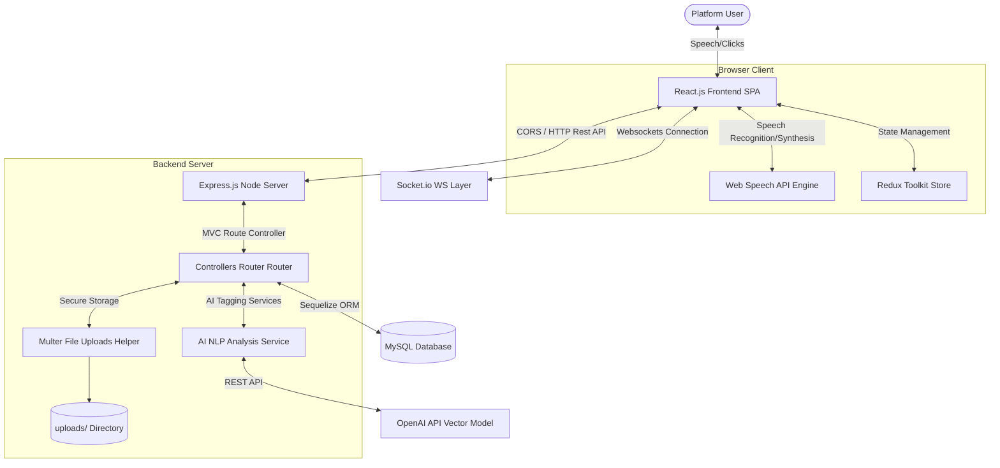
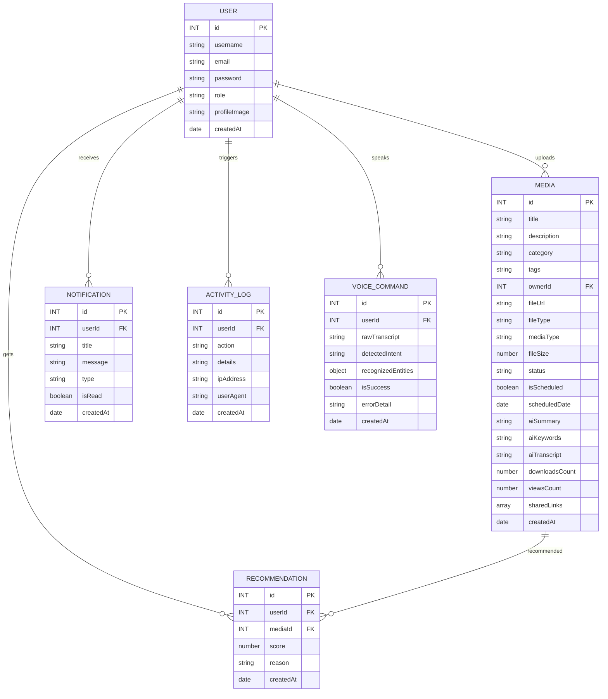
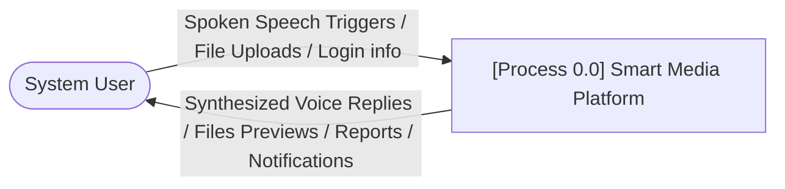
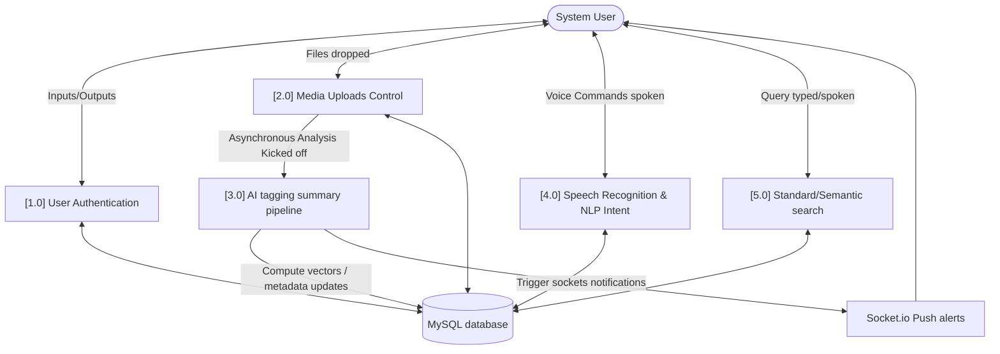
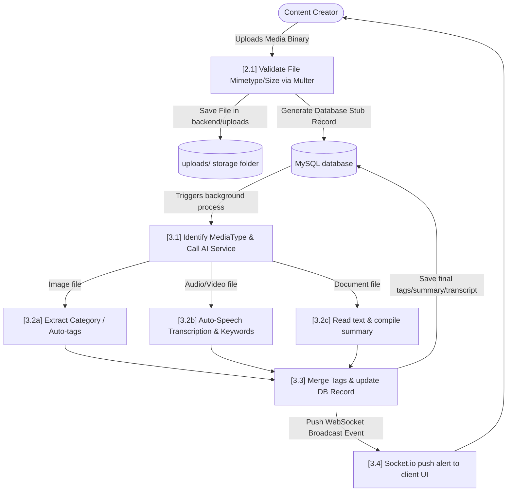

# Project UML and DFD Diagrams

This document contains standard academic diagrams representing system context, entity relationships, use cases, and modular flows using Mermaid format.

---

## 1. System Architecture Diagram
Represents the client-server interaction patterns and connections to services:



---

## 2. Entity-Relationship Diagram (ERD)
Illustrates tables structure and relational foreign key constraints inside MySQL:



---

## 3. Use Case Diagram
Specifies administrative privileges and creators/viewers actions scope:

```mermaid
left_to_right_direction
graph TD
    Viewer((Viewer User))
    Creator((Content Creator))
    Admin((System Admin))

    subgraph Use Cases
        UC1[Register & Authenticate]
        UC2[Voice Command Interface]
        UC3[Smart Text Search]
        UC4[Semantic Vector Search]
        UC5[Download File Assets]
        UC6[Create Media Links]
        
        UC7[Upload Media Files]
        UC8[Schedule Publishing Releases]
        UC9[Monitor personal Views Analytics]
        
        UC10[Manage User Privileges]
        UC11[Review System Audit Trails]
    end

    Viewer --> UC1
    Viewer --> UC2
    Viewer --> UC3
    Viewer --> UC4
    Viewer --> UC5

    Creator --> UC1
    Creator --> UC2
    Creator --> UC7
    Creator --> UC8
    Creator --> UC9
    Creator --> UC6

    Admin --> UC1
    Admin --> UC10
    Admin --> UC11
    Admin --> UC7
```

---

## 4. Data Flow Diagrams (DFD)

### 4.1 DFD Level 0 (Context Diagram)
Defines context boundary connecting actor interactions inputs/outputs:



### 4.2 DFD Level 1
Delineates primary processes, endpoints routers, and databases store queries:



### 4.3 DFD Level 2 (AI Upload Processing Pipeline Detail)
Expands on processes within Media Upload and background AI generation:


